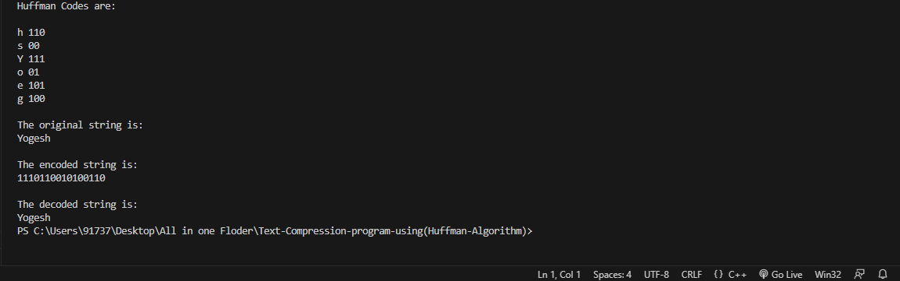

– Developed a text compression program using the Huffman algorithm
– Implemented the Huffman algorithm for encoding and decoding the input text
– Demonstrated an understanding of data compression techniques and their implementation
– Achieved significant reduction in the size of the text through the compression process

